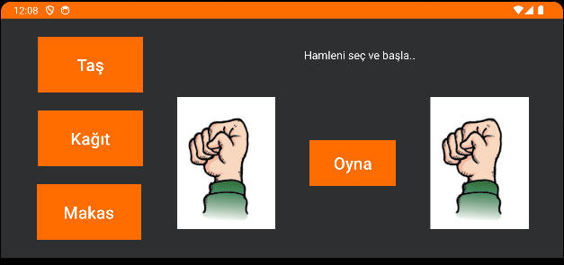

# Taş Kağıt Makas Oyunu

Bu basit Android oyunu, taş kağıt makas oyununu oynamanıza olanak tanır.

## Nasıl Oynanır

1. **Başlatma Ekranı**
   - Oyunu başlatmak için ekranda bulunan "Başlat" düğmesine dokunun.

2. **Seçim Ekranı**
   - Taş, kağıt veya makas simgelerinden birini seçmek için ekrandaki ilgili düğmelere dokunun.

3. **Sonuç Ekranı**
   - Bilgisayarın seçimine karşı sizin seçiminizin kazanıp kazanmadığını gösteren bir ekran.

## Kodlama Detayları

Bu oyun, Kotlin programlama dilinde yazılmıştır. Oyunun ana mantığı şu adımları içerir:

- Kullanıcının seçimini al.
- Bilgisayarın rastgele bir seçim yapmasını sağla.
- Kullanıcı ve bilgisayarın seçimlerini karşılaştır ve sonucu belirle.

## APK İndirme ve Yükleme

1. **APK Dosyasını İndirme**
   - Bu depodan [APK dosyasını](APK/OrangeRPS.apk) indirin.

2. **Android Cihazına Yükleme**
   - İndirdiğiniz APK dosyasını Android cihazınıza transfer edin.

3. **Bilinmeyen Kaynaklardan İzin Verme**
   - Cihazınızın Ayarlar bölümünde "Güvenlik" veya "Uygulamalar" kısmında "Bilinmeyen Kaynaklardan Yüklemeye İzin Ver" seçeneğini etkinleştirin.

4. **APK Yüklemesi**
   - Dosya Yöneticisi veya benzeri bir uygulama ile APK dosyasını bulun ve yükleyin.

5. **Oyunu Başlatma**
   - Oyunu başlatmak için cihazınızın ana ekranında veya uygulama menüsünde oyun simgesine dokunun.

Artık oyununuz Android cihazınızda kullanıma hazır!

